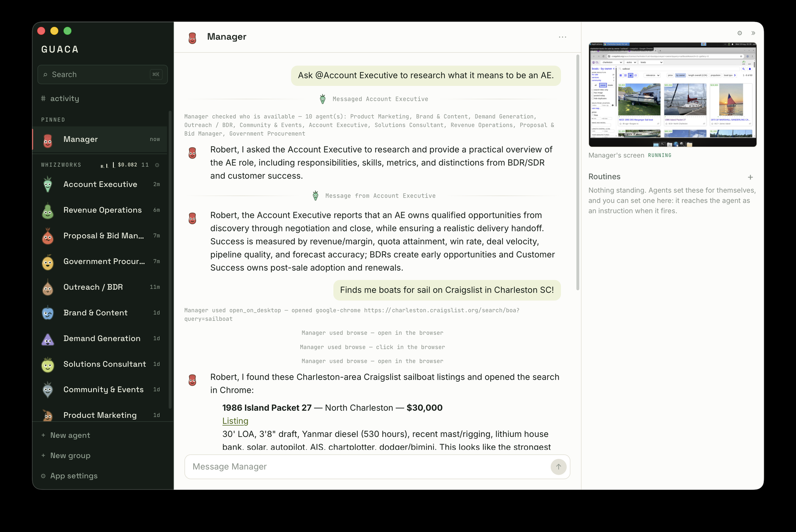
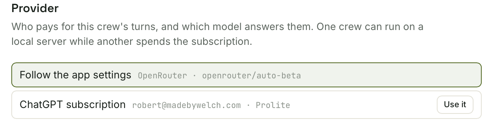
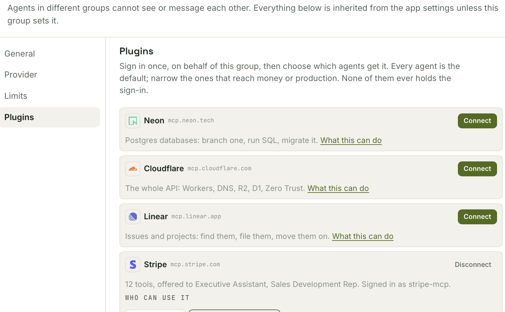
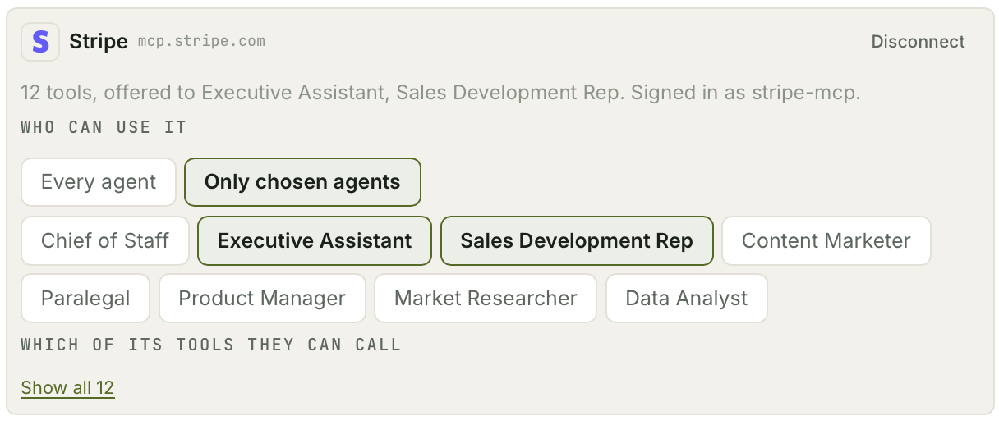
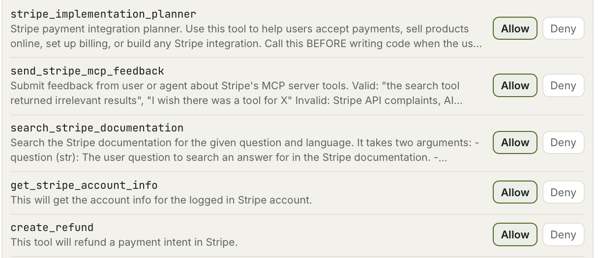

# Guaca

> I built this for myself. It's useful, and maybe it will be for you too.

A local desktop app where you talk to LLM agents and those agents talk to each
other. Slack-shaped: a rail of agents on the left, a conversation on the right,
and an activity view showing every message they send between themselves.



Give one of them a job. It works out who on its team can help, sends them each a
message, and they think at once rather than in turn. You watch it happen: who is
typing, who wrote to whom, what the group has spent so far. When they are done
you get one answer, not a transcript to wade through.

Everything runs on your machine. The only thing that leaves is what you and your
agents type, sent to whichever provider you point it at.

## The crew


Sixteen of them, one per agent. They are not decoration: an agent's character is
how you find it in a rail of eight, and it is doing something at any moment. It
blinks and glances around while idle, looks toward whoever it is writing to,
winds up and throws when a message goes out, and gets visibly hit when one
arrives. Watching the rail tells you what your crew is doing before you have
read a single word of it.

## Run it

```sh
pnpm install
pnpm app          # dev, with hot reload
pnpm app:build    # an installable bundle
```

macOS only, for now.

## Who pays for a turn

Open Settings and choose how turns get paid for. Two kinds of answer.

**A ChatGPT subscription.** Press **Sign in** on the Provider pane, enter the
code it shows you in the browser it opens, and your Plus, Pro, Team or
Enterprise plan covers the work with no per-token bill. It needs a paid plan: a
free account signs in and then cannot make a single call, which Guaca tells you
at the sign-in rather than leaving you to find out. A subscription has an hourly
quota rather than a per-token bill, and every crew spending it shares that
quota.

**An endpoint and a key.** OpenRouter by default, and anything OpenAI-compatible
after that. OpenAI, Groq, Together and Fireworks are spelled correctly for you;
choosing one fills in the fields under it. LM Studio and Ollama are on the same
list and want no key, so a model running on your own machine is two clicks
rather than a code change, and anything else can be typed in.

Then press **Test connection**, which checks the endpoint, the credential and
the model separately. You find out which one is wrong rather than watching an
agent sit silent.

Whichever you choose applies to every agent, and any group can point itself
somewhere else:



One crew can run on a local server while another spends the subscription. A
group that names its own endpoint or key uses those; a group that only names a
model runs that model on whatever the app is paying with.

The model field on an agent is a text box, and beside it are three suggestions
for the kind of work that agent's instructions describe, each with its price.
They are ranked by capability within a category rather than by how much traffic
a model gets, and the price is there because capability ordering ignores it.

**A Claude subscription cannot be used this way, and that is Anthropic's rule
rather than a missing feature.** Consumer Claude OAuth tokens are restricted to
Claude Code and Claude.ai, enforced at their servers, and using one elsewhere
breaches the Consumer Terms and risks the account. Claude models still work here:
they are what OpenRouter serves by default. `docs/PROTOCOL.md` has the detail.

## Try the thing it is for

1. On first run, open the **cafeteria** and press **Pick a starter crew**: Chief
   of Staff, Executive Assistant, Market Researcher and Content Marketer.
   Twenty-one agents are set up in there, from Product Designer to Paralegal,
   and each one arrives as an ordinary agent you can rename, rewrite or delete.
2. Open **Chief of Staff** and send `Introduce yourself to your team.`
3. Watch the rail. Each message between agents draws a pulse traveling between
   them in the sender's color.
4. Open any other agent to see what it received, or the activity view to see the
   whole thing as a sequence diagram, one board per run.

Messaging is asynchronous throughout. Chief of Staff does not wait for Market
Researcher; all four peers think at once.

Right-click any agent in the rail to pin it to the top, to duplicate it, or to
open its profile. Pinning and duplicating are one click because they are the
ones you do; a name and a set of instructions are written once and read often,
so editing a profile is deliberately one click further away.

## Groups

A group is an isolation boundary, and it is the main thing to organize around.
Agents in different groups cannot see or message each other, and a name in
another group does not resolve. It reads exactly like a name belonging to
nobody, so the roster cannot be probed across the line.

**Make one group per company, client or project.** Nothing gets mixed together:
the crew working on one of them cannot message, read or quote the crew working
on another, and nothing you signed one group in to is reachable from the other.

Each group holds three things of its own, all of them inherited from the app
settings until it says otherwise:

- **A provider.** Its own model, endpoint and key, or the subscription, or
  whatever the app is using.
- **Limits.** The five bounds a conversation runs inside: model calls per
  conversation, tool calls per turn, relay depth, messages between any two
  agents, and recipients per send.
- **Plugins.** Signed in once, per group. Below.

Settings resolve agent over group over app, so an expensive crew and a cheap one
can run side by side.

Every group header carries a running token count, a cost, and a sparkline of the
last ninety seconds, so a crew working on its own errands looks different from a
crew that is stuck.

## Plugins

A plugin is a server a group signs in to once. After that, the agents you chose
are offered that server's tools on every turn, and none of them ever holds the
sign-in: the call leaves Guaca with the group's own grant on it.



Six of them: Neon, Cloudflare, Linear, Stripe, AgentMail and Google. That is the
whole list, and it is short on purpose. A server is on it if it publishes its
own tools, if those tools act on your account rather than describe how to, and
if its authorization server lets an application register itself on the spot.
The third one is what makes signing in possible at all from an app anybody can
build: there is no Guaca client id at Neon to register under, and one shipped
inside a binary is not a secret. `docs/PLUGINS.md` argues each of the three.

What the vendor publishes is what the agent gets. Asking the server for its
tools at the moment of connecting is the documentation, the schema and the
capability list in one call, and it is current because it came from the vendor
rather than from a note in this repo.

### Who in the crew gets it

Signing a plugin in is one decision. Handing it out is another.



Every agent in the group is the default and the usual answer. Narrow it for the
plugins that reach money or production. The rest of the crew is still told who
holds it, on the same roster that lists everyone's skills, so an agent asked to
refund a payment names the colleague who can do it rather than reporting that
the workspace cannot.

Filtering the tool definitions is not the enforcement. A model names tools it
was never offered, so the question is asked again on the call path, and the two
refusals are different sentences: "nobody connected this" is yours to fix,
"connected, but not for you" is a peer's to do.

### And which of its tools

A third decision, under the first two: what the server published is not
necessarily what the crew may call.



Switching one off is stored as a refusal rather than as an allow list, so a tool
the vendor ships next month arrives switched on rather than quietly disabled by
a decision nobody took. A switched-off tool is still named in the prompt of the
agents that have the plugin. The name only, no description and no schema, for
the same reason the roster names who holds what: an agent that is simply not
shown `create_refund` answers "we cannot do refunds" to the one person who could
switch it back on.

Google is the one row whose server is not the vendor's. Those tools come from
your own Guaca account, which is what holds the grant. See **The account**.

## What an agent can do

Ten tools, described to the model and visible in the transcript when used, plus
whatever the group's plugins publish:

| Tool | What it does |
|---|---|
| `directory` | Lists the other agents in its group, with their skills |
| `send_message` | Queues a message to one or more of them, with any files, and returns |
| `update_notes` | Rewrites its own memory, which it is shown every turn |
| `schedule` | Sets or cancels its own routines |
| `create_agent` | Proposes a new colleague, and waits for you to allow it |
| `request_permission` | Stops and asks you before acting in your name |
| `run_command` | A shell on its own machine |
| `open_on_desktop` | Launches something on that machine's screen |
| `use_screen` | Looks at the screen, clicks, types, drags |
| `browse` | Uses its own browser, which knows where everything on a page is |

The three above `browse` need a computer, and `browse` needs a browser. Both are
optional, both are separate, and an agent is offered only the tools for what it
actually has. See below.

A turn says what it is doing while it does it: the last sentence of its thinking
that actually finished, under the model's own heading, and a chip per tool call
as the call goes out rather than when it comes back. A `run_command` that sits
for a minute looks like a minute of work rather than a minute of silence.

## Files

Drag a file onto the window and it goes with your next message. Agents send
files to each other the same way, so a draft one of them wrote arrives on
another's machine ready to be worked on.

What an agent gets depends on what the file is. A picture it looks at. Text it
reads. A Word document, a spreadsheet or anything else lands in `~/inbox` on its
own computer, where it opens it with whatever it needs: this app does not learn
file formats, because the machine already knows more of them than it ever would.

One copy is kept per file rather than per recipient, so the same document sent
to four agents is one file on disk. 25 MB each.

## Asking you first

Two things an agent cannot do on its own.

**Adding another agent**, because it changes who you have and each one costs
money to run. **Acting outside the workspace in your name**: sending mail as
you, submitting a form, buying something.

Both stop the agent mid-turn and put a card in the conversation with two
buttons. Nothing happens until you answer, and the answer is kept beside what
was asked. An agent told by a colleague that you have already authorized
something asks you rather than taking a peer's word for it, and the question
comes from the agent that will actually do the thing rather than the one
relaying the request.

**Always allow** exists for adding agents, scoped to one agent asking about one
thing, and is listed on that agent where you can take it back. It is
deliberately absent for acting in your name: a standing yes there would cover
every future send rather than the one in front of you.

## Memory and routines

Each agent has a memory file it maintains itself with `update_notes`, shown to
it at the start of every turn. It is the only thing that survives between
conversations. You can read and edit it in the agent's profile, and a rewrite
opens in the transcript as a diff against the version it replaced, so what the
agent decided to forget is as visible as what it decided to keep.

Memory and notes are one file under two names: memory is what an agent is told
it has, notes is what the tool and the files are called. Ask an agent to update
its memory, to remember something, or to make a note of it, and all three land
in the same place.

An agent can also keep its own schedule: "check the listings every weekday" is a
routine, stored as a next-due time rather than a timer, so it survives a
restart. A routine has a name, an instruction, and a trigger: every hour, every
day, weekdays, every week, every month, or once. Calendar repeats keep the time
of day they were set for, across a clock change and, for weekdays, across the
weekend.

Routines are listed in the panel beside the conversation, one line each. Open
one and the panel becomes that routine: switch it off without deleting it, fire
a test run that does not move the schedule, rewrite what it says, retime it, and
read what it has actually done.

## Computers and browsers

An agent can be given two things, and they are not the same thing. Either is
given to one agent rather than to the workspace, so a crew where one member has
a machine is the normal arrangement rather than an edge case.

**A computer**, with an [E2B](https://e2b.dev) key: a Linux machine with a
desktop, a shell and a screen. The agent works it the way a person does, by
looking at a picture of the screen and aiming a pointer at it. That is
approximate, which is why the web does not belong here, and it is the only way
to use anything that is not a web page: an application, a file, an installer, a
terminal window.

- Every screen action answers with a fresh picture, so the agent is always
  looking at the result of what it just did rather than at a memory of the
  screen two actions ago.
- The machine sleeps after fifteen idle minutes and keeps its disk, so it wakes
  up still signed in to whatever it was signed in to.
- Sandboxes are private, and the viewer is a loopback proxy that holds the
  access tokens, so no URL that reaches a machine is ever guessable or exposed
  to the webview.
- A machine that no live agent refers to is released on the next launch. A
  forgotten sandbox bills exactly like a used one.

**A browser**, with a [Kernel](https://kernel.sh) key: a Chrome in the cloud and
nothing else. Chrome already knows where every link, button and field is, so the
agent asks the page rather than guessing at pixels. This is what the web is for.

- Sign-ins survive. Each agent gets a profile of its own, and a browser is
  created from it, so an account you signed it in to last week is open in a
  browser that did not exist a second ago.
- It goes quiet within seconds of the last action and stops billing, and comes
  back the moment the agent uses it again.
- The live view is where you take over, and taking over is the point: signing an
  agent in is the one thing only you can do.

Both panes sit at the top of the panel beside the conversation: a live picture
while you read, interactive when you click one open. Neither appears without its
key, and the tools that need it are not offered to the model either, so an agent
never spends a turn discovering that something was never set up.

## Connectors

An agent with a computer can already reach almost anything. What it cannot do is
know what it is already allowed into: sign its browser in to LinkedIn and it
will still tell you it has no way to post. The access was never missing. The
knowledge was.

A plugin is the better answer wherever there is one, because the vendor is
telling the agent what it can do rather than the agent working it out from a
token. Connectors are everything else, which is most things, and they come in
two halves. Which half you get is decided by the service rather than by a
preference.

**Sign in for the agent.** Open its browser, or its computer's screen, log in to
whatever you like, and that is the whole procedure. Nothing is declared
anywhere: Chrome is holding the cookies, so Guaca asks it what it is signed in
to and puts the answer in that agent's prompt and on every other agent's roster.
Log out and it disappears the same way. There is nowhere to type a password
because Guaca never handles one.

Which of the two you signed in on is recorded and shown, because the two have
unrelated cookie jars. An agent told only "you can reach Gmail" when the session
is on its computer's screen will call `browse`, be shown a login page, and
report the account as broken.

**Credentials, on the group.** For an API with a plain token, paste it into the
group's settings and name a variable. Every machine in that group gets it in the
environment of every command it runs.

Two things follow from where each half physically lives, and both are load
bearing:

- A session is cookies in **one** jar, so it belongs to one agent.
  The rest of the crew is told who holds it, in the same roster that lists
  skills, so an agent asked to post to LinkedIn says "Researcher can do that"
  rather than "I am not signed in". A skill is a claim an agent wrote about
  itself; a session is a fact read off a disk.
- A credential is a string, so the whole group gets it, and **it never reaches
  the model.** It goes from SQLite into the environment of a sandbox command and
  nowhere else: not into a prompt, not into the transcript, not into the
  webview, not onto the sandbox's disk. The agent is told the variable's name
  and told not to print it.

Detection is deliberately cautious, because a wrong claim is worse than a
missing one: an agent that believes it can read Gmail wastes a turn finding out
it cannot, and you see a broken account rather than an absent one. Sites are
recognized by the cookie that actually means somebody logged in, so a browser
holding `google.com` cookies it collected while signed out is correctly reported
as signed out. Anything not on that list is only mentioned if the browser has
genuinely visited it *and* holds a cookie implying an identity, and it is passed
to the agent as a maybe. On a real profile holding a thousand cookies across
three hundred domains, that combination reported exactly the one account the
machine actually had.

The recognized-service list lives in `domain/signin.rs` and adding one is a
line.

Being signed in is also what makes a hostile web page worth writing, so every
page an agent reads arrives labeled as content rather than instruction, and the
system prompt says what a signed-in agent must stop short of. See **Credit**.

## The account

Optional, and an install that never signs in never contacts it. Everything above
works with no account at all.

It exists for one thing: a hosted OAuth client. Signing an agent's own browser
in is the better answer wherever it works, and it stops working at exactly the
services that will only issue programmatic access to a registered application.
Gmail is the one everybody hits. Guaca cannot be that application, because its
client secret would ship inside a download anybody can read. `guaca.bot` can:
it holds the client and the refresh token, and hands this machine a short-lived
access token. That is where the Google plugin's tools come from, and it is read
on a turn that calls one of them and nowhere else. `docs/ACCOUNT.md`.

## The menu bar

Guaca keeps working when the window is not in front of you, so there is an
avocado in the menu bar saying what it is doing. An outline means nothing is
running, a filled one means something is, and it turns red with a count beside
it when an agent is parked waiting on you. Hovering says the same thing in one
line, with what the session has cost.

Opening it lists what is waiting on you, who is working, and the spend twice:
this session and all time. A permission request can be answered from there,
with the fields of the request under it, so noticing a parked turn and dealing
with it is one gesture instead of a trip back into the app. The same rule
applies as in the conversation: **always allow** is offered for adding agents
and never for acting in your name.

Two things to do from there. **Open Guaca**, and **stop everything running**,
which appears only when there is something to stop.

Closing the window leaves Guaca in the menu bar rather than quitting it, because
agents keep their own appointments and a routine set for every morning should
not stop firing the first time you tidy your screen. Command-Q and **Quit
Guaca** still quit.

## Data

Everything lives in one directory:

```
~/Library/Application Support/com.madebywelch.guac/
  guac.db        agents, groups, messages, routines, usage, permissions,
                 plugin grants
  config.json    settings, written 0600
  subscription.json  the ChatGPT sign-in, written 0600, absent until you sign in
  account.json   the guaca.bot sign-in, the same, absent until you sign in
  workspace/     one markdown file per agent: its memory
  files/         everything you or an agent attached, by content hash
```

A plugin's grant is a column on its row: never returned by a command, never
rendered into a prompt, never sent to a model.

The API key is stored in `config.json` in plaintext, and the two sign-ins in
their own files beside it. Guaca is a local app with no auth, and a key
encrypted with a key sitting beside it would be theater. The honest answer is the
OS keychain, and that is a deliberate follow-up rather than something faked here.
It matters more for the sign-ins than for the key: those credentials belong to
accounts with more than Guaca behind them. **Sign out** removes the file.

Deleting an agent is a soft delete: it leaves the rail and can never be messaged
again, its computer and browser are destroyed along with the browser profile
holding its sign-ins, and its memory goes, but what it already said stays
readable and its name becomes free to reuse. **Start fresh** on a group
resets its whole crew (transcripts, routines, memories and spend) while keeping
the agents themselves. Deleting a group takes the crew and the machines they
were renting with it.

## Working on it

```sh
./scripts/ci.sh          # lint, typecheck, build, every suite
GUAC_LOG=guac=debug pnpm app
```

`AGENTS.md` is the map for anyone, human or otherwise, about to change
something: where everything lives, and which file to read first for the part
being changed. `docs/ARCHITECTURE.md` is the long version, including why agent
conversations end rather than going round forever, which is the hardest thing
here. `docs/PLUGINS.md`, `docs/ACCOUNT.md`, `docs/ROUTINES.md`,
`docs/MACHINES.md`, `docs/BROWSERS.md` and `docs/WORKSPACE.md` cover the
subsystems it does not, and `docs/PROTOCOL.md` records what the interoperability
literature contributed.

## Status

A working app that its author uses, not a product. It is macOS-first: the paths
above are macOS paths, and nothing else has been tried. Expect rough edges,
particularly around sandboxes, which are the newest part.

## Credit

**Inspired by Grokbot, and not a clone of it.** The shape came from there:
agents you talk to that also talk to each other, in a room you can watch.
Everything under that shape is this repo's own work, sharing no code, no assets
and no service with it. Guaca runs on your machine, on whichever provider you
point it at.

Its message layer is derived from the four agent interoperability protocols
(MCP, ACP, A2A, ANP) and from the survey comparing them, *A survey of agent
interoperability protocols* by Abul Ehtesham, Aditi Singh, Gaurav Kumar Gupta
and Saket Kumar ([arXiv 2505.02279](https://arxiv.org/abs/2505.02279)). A2A in
particular gave the Agent Card, discovery as a first-class operation, and card
versioning. `docs/PROTOCOL.md` records what was taken from each, what was cut,
and what had to be invented, chiefly termination, which none of them specify.

Connectors have two kinds rather than one because of *Beyond Browsing: API-Based
Web Agents* by Yueqi Song, Frank Xu, Shuyan Zhou and Graham Neubig
([arXiv 2410.16464](https://arxiv.org/abs/2410.16464)). Putting API-calling and
browsing agents on the same WebArena tasks, they found APIs beat browsing, and a
hybrid that could choose beat both, by 24.0 points absolute over browsing alone.
The design that follows is not "an API when there is one, a browser otherwise":
it is telling one agent about both and letting it pick, which is what the
prompt's **What you can reach** section is for.

The security half comes from *BrowseSafe: Understanding and Preventing Prompt
Injection Within AI Browser Agents* by Kaiyuan Zhang, Mark Tenenholtz, Kyle
Polley, Jerry Ma, Denis Yarats and Ninghui Li
([arXiv 2511.20597](https://arxiv.org/abs/2511.20597)). Its useful move is to
benchmark injections that drive real-world *actions* rather than text output,
which is exactly what a signed-in session turns a web page into: the payload no
longer has to talk an agent into obtaining access, because it already has the
operator's. Guaca takes the architectural half of their defense-in-depth
argument, which is what a local app can actually hold: page content is labeled
at the point it enters the turn, credentials never enter the model's context at
all, and the signed-in agent is told where to stop. Neither paper's authors
endorse any of this.

Plugin marks are [Simple Icons](https://simpleicons.org), CC0 1.0. Trademarks
belong to their owners.

## License

[GNU AGPL v3](LICENSE). You can use, modify and run it, including commercially;
if you distribute it or run a modified version as a network service, that
version has to be published under the same license.
